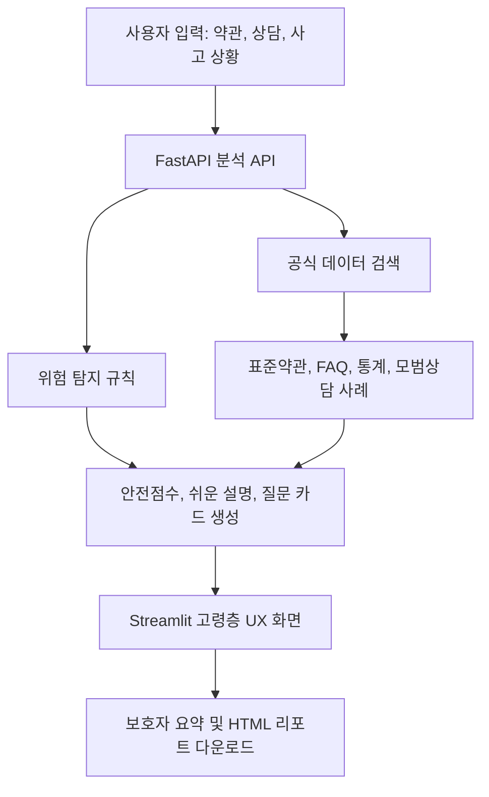

# 실버 금융가드 AI 포트폴리오 브리프

## 한 줄 소개

가입 전 3분, 어르신 금융계약 안전점검 AI. 상담 내용과 약관을 쉬운 말로 점검해 설명의무 누락, 불완전판매 위험, 불리한 조항, 지금 물어봐야 할 질문을 알려주는 금융계약 동행 에이전트입니다.

## 문제 정의

고령층 금융소비자는 금융상품 가입, 전화 권유, 상담, 사고 대응 과정에서 정보 비대칭을 크게 겪습니다. 특히 가입 전 상담에서는 원금 손실 가능성, 중도해지 손해, 개인정보 제공, 수수료, 적합성 설명을 충분히 이해하지 못한 채 동의하는 경우가 생깁니다.

실버 금융가드 AI는 단순 상담 챗봇이 아니라, 고령층의 실제 금융계약 여정을 따라가는 보호 에이전트입니다. 가입 전에는 위험을 막고, 상담 중에는 꼭 물어볼 질문을 만들어주고, 사고 후에는 골든타임 행동과 민원 자료를 정리합니다.

## 핵심 사용자

- 금융 약관이나 상품설명서를 읽기 어려운 고령층 사용자
- 부모님의 금융 가입과 사고 대응을 도와야 하는 보호자
- 금융소비자 보호 서비스를 시연하거나 교육하려는 기관·상담 담당자

## 핵심 기능

- 가입 전 안심점검: 약관, 계약서, 문자, 상담 내용을 입력하면 자동 연장, 위약금, 제3자 정보제공, 압박 판매, 원금 보장 오인 표현을 탐지합니다.
- 가입 전 안전점수: 탐지된 위험 수준과 개수를 종합해 `안심`, `주의`, `위험`, `매우 위험` 단계로 보여줍니다.
- 직원에게 보여줄 질문 카드: 사용자가 상담 중 그대로 읽을 수 있는 질문을 큰 카드로 제공합니다.
- 보호자 공유 요약: 부모님의 금융 가입을 도와야 하는 가족이 빠르게 확인할 수 있도록 핵심 위험과 준비자료를 정리합니다.
- 상황 선택형 첫 화면: `가입하려고 해요`, `어려운 단어가 있어요`, `돈을 잘못 보냈어요`, `민원을 넣고 싶어요`처럼 기능명이 아니라 생활 상황에서 시작하게 합니다.
- 3줄 결론 우선 표시: 상세 근거보다 `지금 판단`, `위험 개수`, `다음 행동`을 먼저 보여주어 읽기 부담을 줄입니다.
- 표준약관 비교: 공정거래위원회 은행 표준약관 3종을 근거로 관련 조항을 찾아 확인해야 할 쟁점을 보여줍니다.
- 설명의무 위험 점검: 투자 권유·상담 문구에서 확정 수익 표현, 손실 설명 부족, 급박한 가입 압박을 탐지합니다.
- 금융사고 대응: 착오송금과 보이스피싱을 분류하고, 즉시 행동·10분 내 행동·당일 행동·추후 행동으로 나누어 안내합니다.
- 공식 데이터 근거: 경찰청 보이스피싱 통계, 우체국 금융사기 사례, 예금보험공사 FAQ 등 공식 데이터를 함께 제시합니다.
- 민원 초안 작성: 사용자 진술을 바탕으로 공정위 모범상담 유사 사례, 주장 포인트, 체크리스트, 첨부자료를 포함한 민원 초안을 생성합니다.
- 고령층 UX: 큰 글씨, 고대비 화면, 돋보기 보기, 긴급 연락 카드, 큰 단계 카드를 제공합니다.
- 리포트 다운로드: 약관 점검, 설명의무 점검, 사고 대응, 민원 초안을 HTML/TXT/Markdown 형태로 저장할 수 있습니다.

## 공식 데이터 활용

현재 앱에 import된 공식 데이터는 16종입니다.

- 금융위원회 금융용어사전 229건
- 예금보험공사 착오송금 반환지원제도 FAQ 12건
- 예금보험공사 예금보험 용어사전 70건
- 예금보험공사 부보금융회사 목록 285건
- 서민금융진흥원 대표 FAQ 467건
- 서민금융진흥원 미소금융 지점 163건
- 서민금융진흥원 미소금융 연령대별 대출실적 90건
- 공정거래위원회 전화권유판매사업자 서울·경기 12,898건
- 한국언론진흥재단 보이스피싱 뉴스 메타데이터 11,968건
- 공정거래위원회 소비자 모범상담 사례 566건
- 우체국금융개발원 우체국 금융 사기계좌 정보 1,209건
- 경찰청 보이스피싱 현황 10건
- 경찰청 시도청별 보이스피싱 피해금액 18건
- 공정거래위원회 은행 표준약관 3종
- 금융 분야 불공정약관 설명회 PDF 3쪽
- 금융소비자 보호 PDF 37쪽

## 기술 스택

- Frontend: Streamlit
- Backend: FastAPI
- Data Processing: Python CSV/PDF/HWPX ingestion
- Validation: pytest, compileall
- Data Storage: JSON 기반 정제 데이터
- Architecture: Rule-based detection + official-data retrieval + senior-friendly UI

## 아키텍처



## 평가 기준 대응

### 문제해결능력

- 문제 정의 및 필요성: 고령층 금융소비자가 금융상품 가입 전 설명을 충분히 이해하지 못해 불완전판매나 불리한 계약에 노출되는 문제를 직접 겨냥합니다.
- 아이디어 활용 가능성: 금융상품 가입 전 상담 직후, 약관 동의 직전, 가족과 가입 여부를 상의할 때, 사고 발생 직후, 민원 접수 전 등 실제 사용 상황이 명확합니다.
- 창의성 및 효과: 기존의 사후 민원·피싱 탐지를 넘어 `가입 전 안전점수`, `직원 질문 카드`, `보호자 공유 요약`, `사고 대응`, `민원 초안`을 하나의 고령층 금융계약 동행 흐름으로 통합했습니다.

## 고령층 실제 사용성 검토

70대 고령층 사용자가 혼자 서비스를 사용한다고 가정하면, 약관 문장을 복사해 붙여넣거나 PDF 파일을 찾아 업로드하는 과정은 여전히 어렵습니다. 따라서 MVP에서는 기능명보다 생활 상황으로 시작하고, 상세 분석보다 3줄 결론을 먼저 보여주는 방향으로 UX를 조정했습니다.

- 시작 장벽 완화: 첫 화면에서 `무슨 일이 있으세요?`를 묻고 상황별 다음 행동을 안내합니다.
- 입력 부담 완화: `텍스트 입력` 대신 `직접 적기`, `PDF/텍스트 파일 업로드` 대신 `파일 올리기`로 표현을 단순화했습니다.
- 인지 부담 완화: 분석 결과 상단에 `먼저 볼 3줄 결론`을 배치했습니다.
- 가족 동행 강화: 보호자가 바로 이해할 수 있는 공유 요약을 제공합니다.
- 다음 개선 과제: 사진 OCR, 음성 입력, 음성 읽어주기, 보호자에게 보낼 문장 복사, 탭 없는 단계형 화면을 추가하면 실제 고령층 접근성이 더 높아집니다.

### 기술적 완성도

- 기술 적정성: OCR 전 단계에서도 텍스트/PDF/HWPX/CSV 기반 공식 데이터 RAG형 검색과 규칙 기반 탐지를 안정적으로 구현했습니다.
- 개발 계획 구체성: 데이터 수집, 정제, API, UI, 리포트 다운로드, 테스트까지 단계적으로 구현했습니다.
- 기술 실현 가능성: 모든 핵심 기능이 로컬 MVP로 동작하며, 테스트와 정제 스크립트로 재현 가능합니다.

## 실행 방법

```bash
cd /Users/kkssyy/Projects/Silver_Finance_Guard_AI/backend
source .venv/bin/activate
uvicorn app.main:app --reload --port 8000
```

```bash
cd /Users/kkssyy/Projects/Silver_Finance_Guard_AI/frontend
source .venv/bin/activate
streamlit run app.py
```

## 한계와 개선 계획

- 현재 사진 OCR은 다음 단계 기능입니다. 약관 사진 업로드를 위해 OCR 모델을 연결할 수 있습니다.
- 현재 판단은 법률 판단이 아니라 소비자 보호 보조 정보입니다. 실제 민원 제출 전 사실관계 확인이 필요합니다.
- 향후 벡터 검색, LLM 기반 쉬운 말 재작성, 음성 입력/읽어주기 기능을 추가하면 고령층 접근성을 더 높일 수 있습니다.
- 민원 제출 기관 자동 추천, 서류 자동 PDF 양식 작성, 보호자 공유 링크 기능으로 확장할 수 있습니다.
